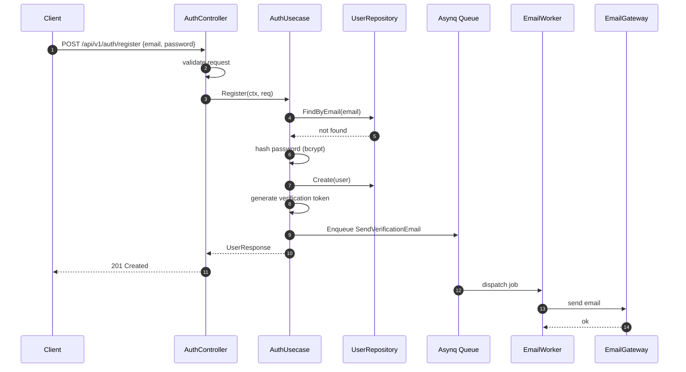
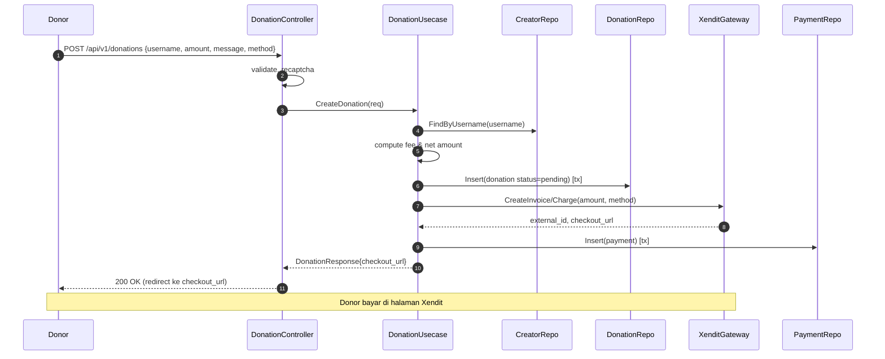
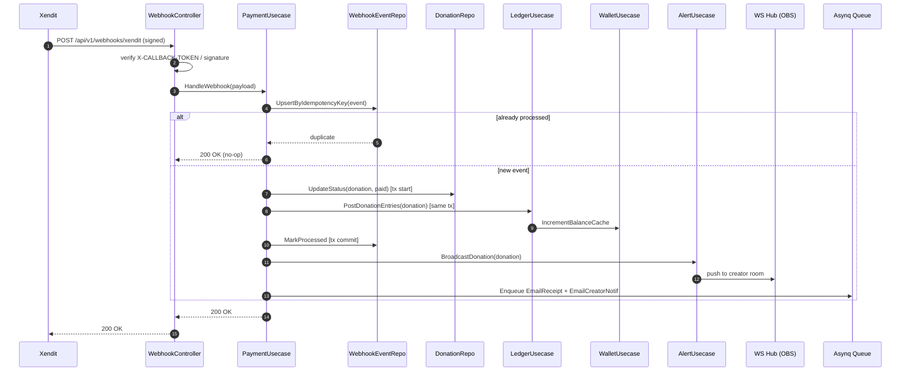
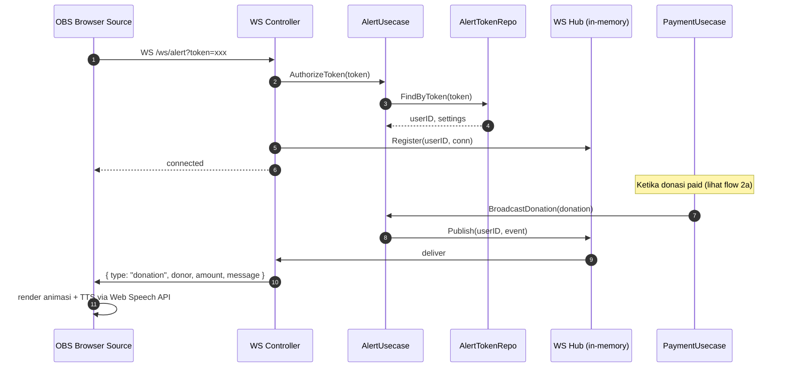
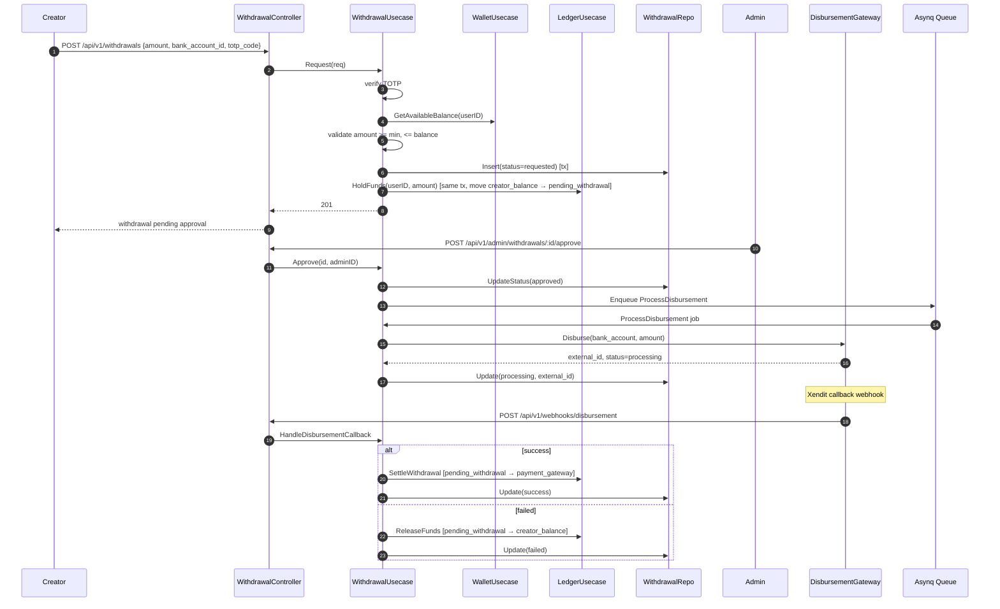
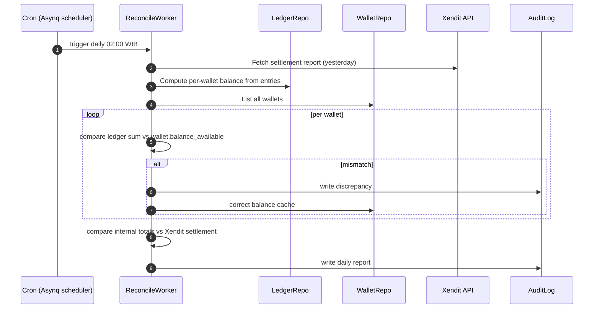
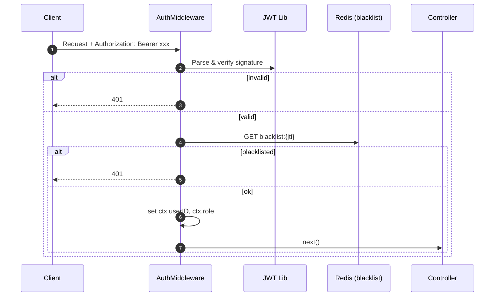
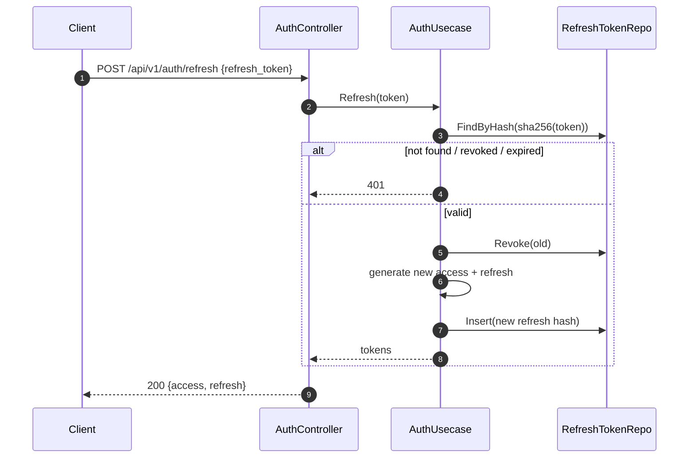

# Kreatip Backend — Flow Diagrams

Semua sequence diagram di bawah ini fokus di backend (clean architecture layer: Controller → Usecase → Repository/Gateway).

---

## 1. Register + Verifikasi Email

---

## 2. Donation Flow (Guest → Xendit → Webhook → Ledger → Alert)

### 2a. Webhook Handler (uang diterima)

Key rules:
- **Idempotency**: `webhook_events.idempotency_key` = `provider + external_id + event_type`.
- **All-or-nothing**: update donation, insert ledger entries, mark webhook processed — dalam **satu DB transaction**.
- **Retry-safe**: Xendit akan retry jika non-2xx; handler harus idempotent.

---

## 3. Streamer Alert Overlay (OBS)

Catatan: WS hub cukup in-memory untuk MVP (single instance). Untuk horizontal scaling di v2 pakai Redis Pub/Sub.

---

## 4. Withdrawal Flow

---

## 5. Daily Reconciliation Job

---

## 6. JWT Auth Middleware

---

## 7. Refresh Token Rotation

